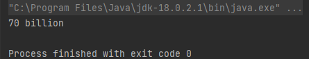

# NLP Cloud Connector

---

A way to access the models and endpoints provided by https://nlpcloud.com/ via Apache HttpClient.

Currently able to access the "question" endpoint with the models "Roberta Base Squad2" (CPU), "Fast GPT-J" (GPU) and "Finetuned GPT-NeoX-20B" (GPU) and the "generation" endpoint with "Fast GPT-J" (GPU) and "Finetuned GPT-NeoX-20B" (GPU).

API Key has to be provided in a file called ".env". Check out "env.example".

---

Console output of the example with "Roberta Base Squad2" (CPU), the question being
> "How many threats are blocked per day?"

and the context
> "We have built security into every component of the network. Cloudflare’s 155 Tbps network blocks an average of 70 billion threats per day, including some of the largest DDoS attacks ever recorded. Each and every login, request, and response that goes through our network strengthens the machine learning that we apply to detect and block threats at the edge, before they ever reach your organization."